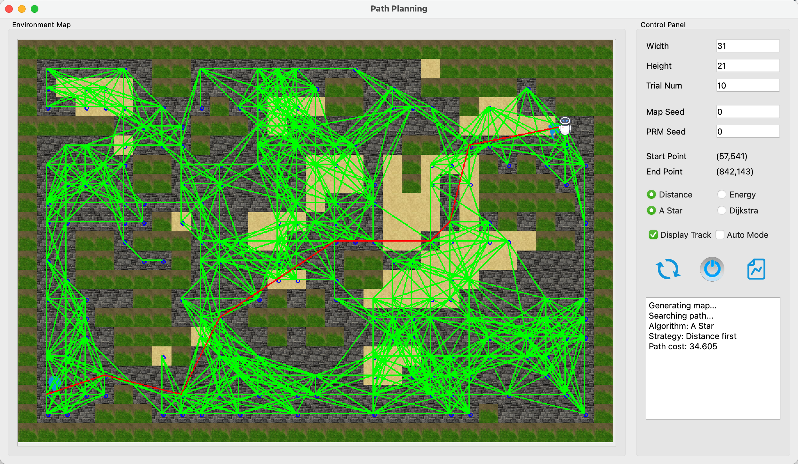
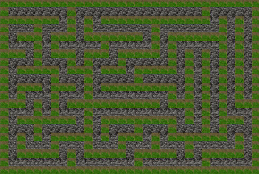
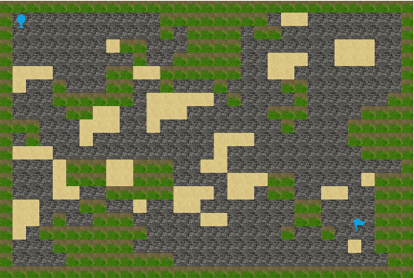
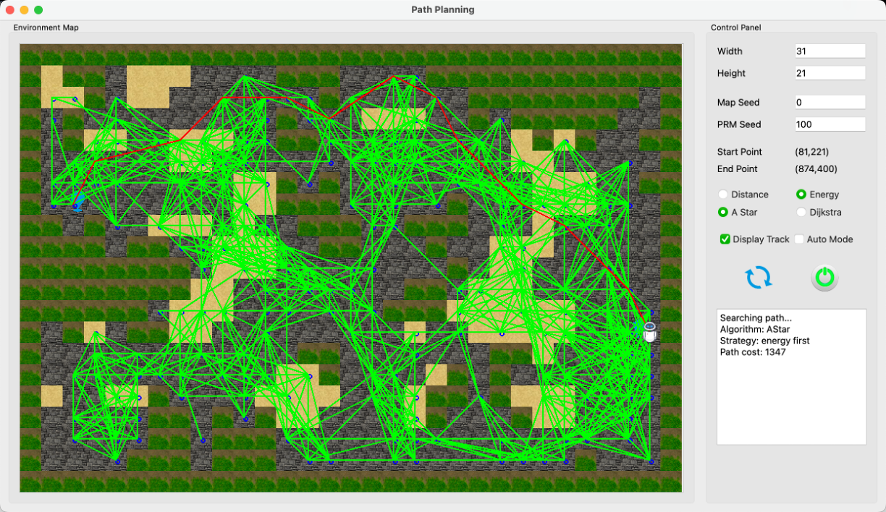

# Path Planning Demo
<div align="center">

</div>

A rotbot path planning demo supporting for the following features:

- [x] randomly generate environment maps with three types of terrain: road, wall and sandy
- [x] allow users to set start and goal points in any valid position
- [x] contruct graphs for motion planning by (Probabilistic Roadmap Method) PRM algorithm
- [x] path palnning with Dijkstra's algorithm or $A^*$ algorithm
- [x] show an animation of the robot pathfinding around the environment map

> The simulation program is developed in C++ and provides a Qt-based GUI. It supports for multiple languages, including English and Chinese. 

## Set up
Please make sure that you have installed the Qt (version > 6.0) and CMake correctly.

1. update the .ts files
```shell
lupdate src -ts lang/en_US.ts lang/zh_CN.ts
```

2. build the project
```shell
mkdir build
cd build
cmake ..
cmake --build .
```

## Environment Map Generation
The environment map has three types of terrain: 
- roads that robots can traverse effortlessly, 
- sandy areas where robots need to expend more energy, 
- and obstacles that are impossible to pass through. 
  
As shown in the following figure, this project designs the following map generation strategy to produce diverse maps:

1. the map is initialized as a grid of alternating road and obstacle cells; 
2. to guarantee the connectivity of map, depth-first search is applied to create a maze-like minimum connected graph; 
3. the final map is generated by inflating and deflating obstacle cells randomly, resulting in more diverse and real environments. Moreover, some road cells are changed to sandy cells. 

Users can set start and end points for the robot in any valid position (as blue flags in the figure).

<div align="center">
    <table>
        <tr>
            <td align="center">
                <br>
                (a)
            </td>
            <td align="center">
                <br>
                (b)
            </td>
            <td align="center">
                <br>
                (c)
            </td>
        </tr>
    </table>
</div>

## PRM Algorithm
Notably, instead of regarding all non-obstacle blocks as nodes of graph, this project uses the **Probabilistic Roadmap Method (PRM)**, which constructs a graph by sampling random points in the environment, making it well-suited for motion planning in large spaces. Each sampled node is connected with its top-K nearest neighbors.

Please refer to [Probabilistic Roadmaps-Mathworks](https://ww2.mathworks.cn/help/robotics/ug/probabilistic-roadmaps-prm.html) for more details about PRM.

## Path Planning
Then, Dijkstra and A star algorithms are performed on the constructed graph to plan a path from the start to the goal point given by the user.

For the details of Dijkstra and A star algorithms, please refer to [Dijkstra-Wikipedia](https://en.wikipedia.org/wiki/Dijkstra%27s_algorithm) and [A*-Wikipedia](https://en.wikipedia.org/wiki/A*_search_algorithm).

Additionally, this projects designs two cost strategies: distance-first and energy-first. 
- The former is straightforward, in which the robot needs to find a valid path with the shortest distance.
- The latter requires the robot to plan a path that consumes as little energy as possible, i.e., goes through fewer sandy cells.

The following figures show two cases for distance-first and energy-first, respectively. It can be seen that **the robot chooses a path with fewer sandy blocks when the energy first criterion is enabled**
<div align="center">

<div>(a) A case for A star algorithm under the distance-first setting</div>
</div>

<div align="center">

<div>(b) A case for A star algorithm under the energy-first setting</div>
</div>


## LICENSE
This project is under the MIT license. See [LICENSE](LICENSE) for details.
